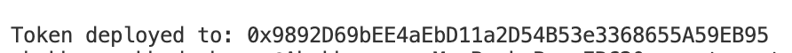
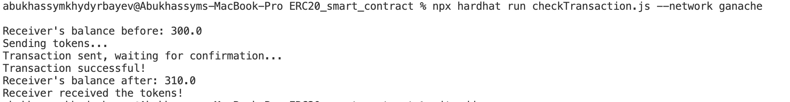
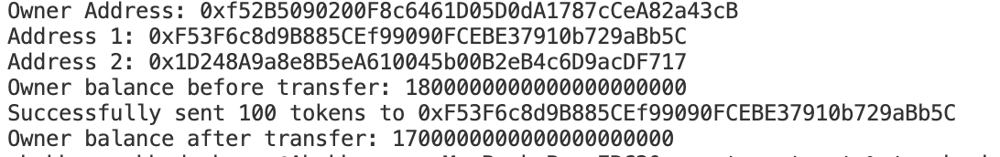

# ERC20 Token Transaction Check

This project contains a simple Hardhat script to deploy and interact with an ERC20 token smart contract. It includes functionality to transfer tokens to a receiver and verify whether the transaction was successful by checking the receiver's balance before and after the transfer.

### How to Use:

1. **Clone or Download the Repository**: If you're working within a repository, clone or download it to your local machine.
2. **Install Dependencies**: Run `npm install` in the project directory to install all necessary dependencies.
3. **Compile and Deploy the Contract**: Use `npx hardhat compile` to compile the contracts and `npx hardhat run scripts/deploy.js --network ganache` to deploy your contract to Ganache.
4. **Run the Transaction Check**: Run the script using `npx hardhat run checkTransaction.js --network ganache` to check the transfer and balance.
5. **Customization**: Modify the contract address, receiver address, and token amount as needed in the script.


## Requirements

- [Node.js](https://nodejs.org/)
- [Hardhat](https://hardhat.org/)
- [Ganache](https://www.trufflesuite.com/ganache) (local blockchain for development)

## Setup

1. Clone or download this repository to your local machine.

2. Install the necessary dependencies by running the following command in the project directory:

```bash
    npm install
```

3. Make sure you have Ganache running locally. 

4. Update the contract address and receiver address in the script according to your setup.

### Deployment and Transaction Check

#### 1. Compile and Deploy the Contract

Before running the transaction check, make sure you have compiled and deployed the ERC20 token contract to your local Ganache instance.

To compile the contracts, run the following command in your project directory:

```bash
npx hardhat compile
```

```bash
npx hardhat node
```

After compilation, deploy the contract using:

```bash
npx hardhat run scripts/deploy.js --network ganache
```

This command will deploy your ERC20 contract to the Ganache network.

#### 2. Run the Transaction Check

Once the contract is deployed, you can use the script to send tokens to a receiver address and verify the transfer. The script will check the receiver's balance before and after the transaction.

Test the transatction, use:
```bash
npx hardhat run test/test.js --network ganache
```

To run the transaction check, use:

```bash
npx hardhat run checkTransaction.js --network ganache
```

# Token Transfer Script

This script performs the following actions:

1. **Retrieves the contract instance** from the provided contract address.
2. **Transfers a specified amount of tokens** to the receiver address.
3. **Checks the receiver's balance** both before and after the transaction.
4. **Verifies** if the receiver received the expected amount of tokens.
5. Optionally, listens for the `Transfer` event and confirms the transaction.

## 3. Check the Output

After running the script, the console will display the following information:

- **Receiver's balance before the transfer**: Shows the initial balance of the receiver before the transaction.
- **Transaction status**: Confirms whether the transfer was successful.
- **Receiver's balance after the transfer**: Displays the balance after the tokens are sent.
- **Confirmation of receipt**: Confirms if the receiver received the expected amount of tokens.



## Customization

You can modify the script to:

- **Change the amount of tokens transferred**: Adjust the `amount` variable in the `checkTransaction.js` file to transfer a different number of tokens.
- **Update the contract and receiver addresses**: Modify the contract address and receiver address in the `checkTransaction.js` script to match your setup and contract instance.

## Troubleshooting

- Ensure that your **Ganache** instance is running and correctly configured in your Hardhat `hardhat.config.js` file.
- If you encounter issues with the transaction or balance checks, verify the **contract address** in your `checkTransaction.js` file and ensure that the contract is accessible on the correct network.


## License

This project is licensed under the MIT License - see the [LICENSE](LICENSE) file for details.

Let me know if you need any further changes or additional details!
